# 个人keymap布局说明

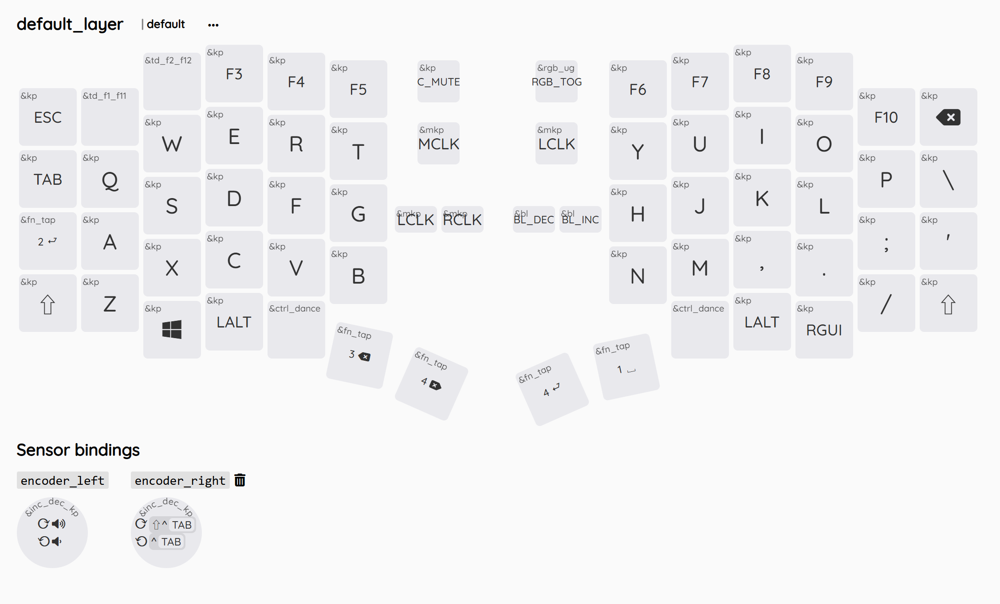

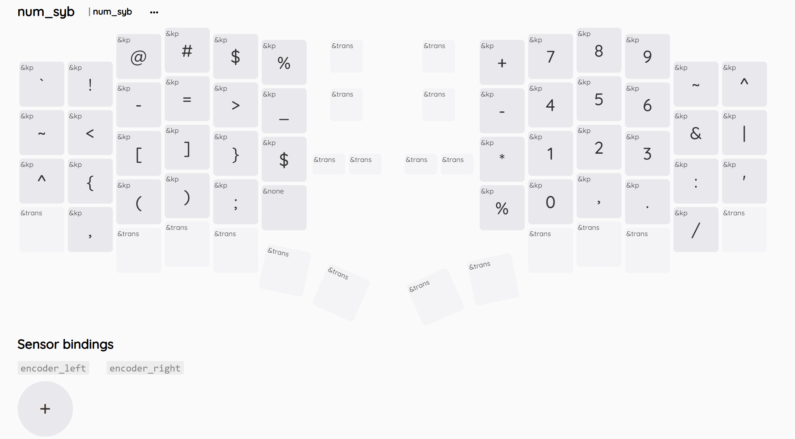

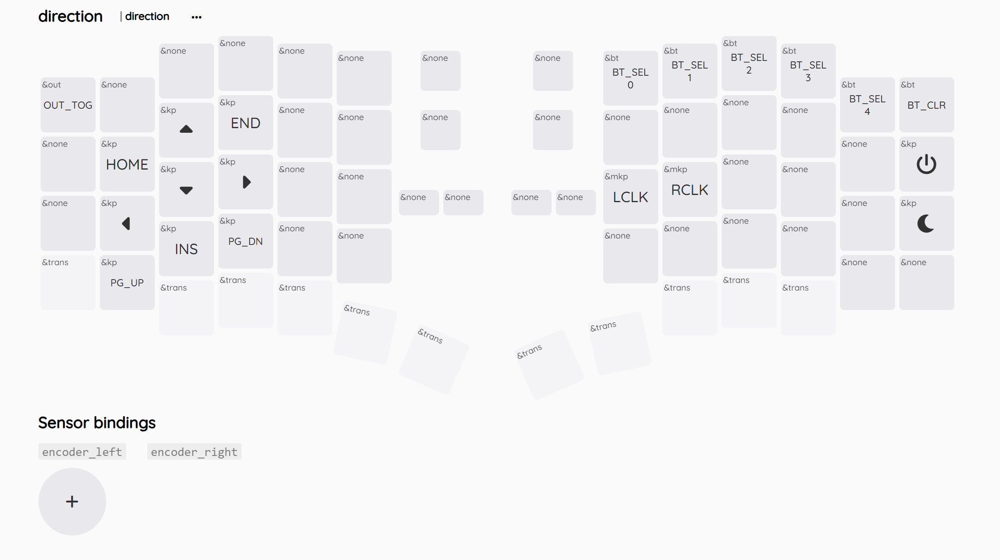

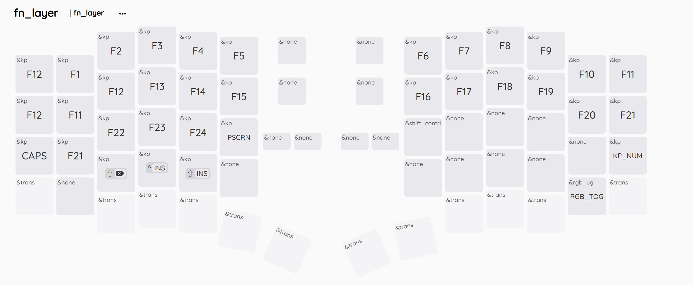

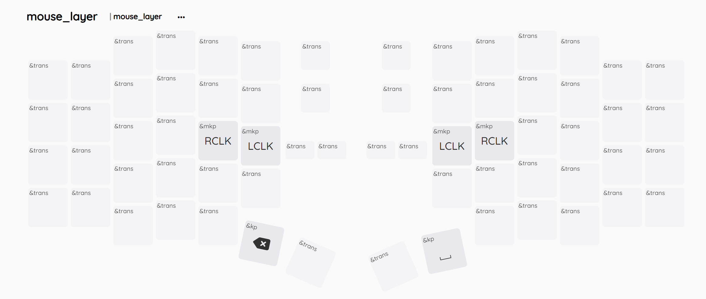
## 数字符号层设计思路

- 左手拇指键最容易按到的键为空格键。
- 中文输入使用空格键键入当前输入法第一个候选词。
- 如果第一个候选词不正确，需要数字选词，顺势按下空格，进入数字符号层，可以快速键入数字键。
- 使用上排数字键，而非小键盘的键，以避免num锁定带来的不确定性。

### 数字键符号键层轻松记忆

- 数字键的789和标准键盘上789应该出现的位置一致，而其他数字键之间的相对位置，和标准键盘相对位置相同。
- 蓝色框是原本应该出现位置的字符，数字区保留这些字符，以方便打出数字与`,./:'|`的组合,这在大多数需要输入数字的情况下非常实用。
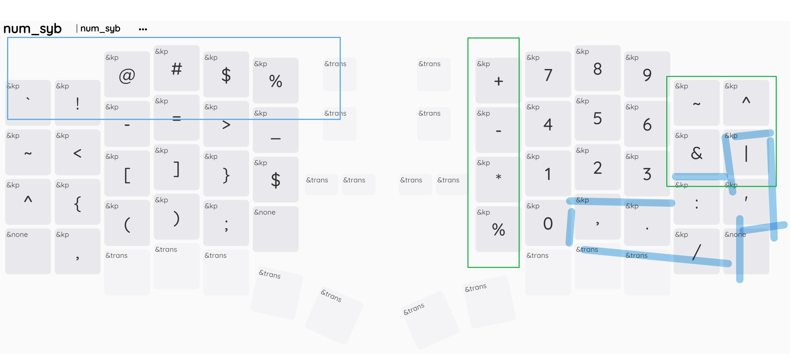
- 右上角为位运算符区，与原本就在键盘上的|相互呼应。
- 在数字键左侧是四则运算符号`+—*%`，由于`/`已经在该键标准布局中原本的位置出现过，所以这里用`%`代替。

- 该横排用于快速键入`<=`,`>=`,`->`,`<-`,`~>`,`<~`等编程需要的符号。
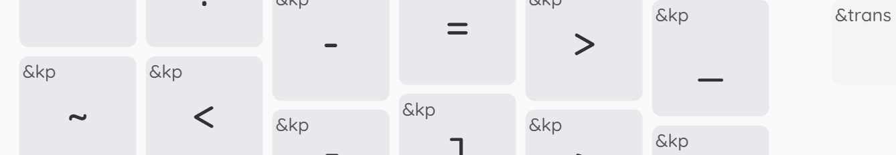
- `^$`分别对应正则表达式的开头和结尾符号。
- 补充了缺少的中括号大括号和附近的`<>`尖括号以及`（）`呼应
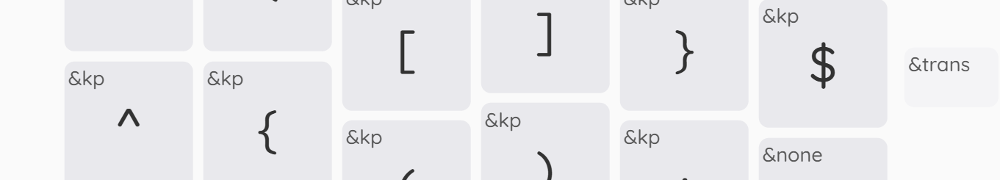
- 最下面一排快速键入编程常见的符号组合：`(,);`
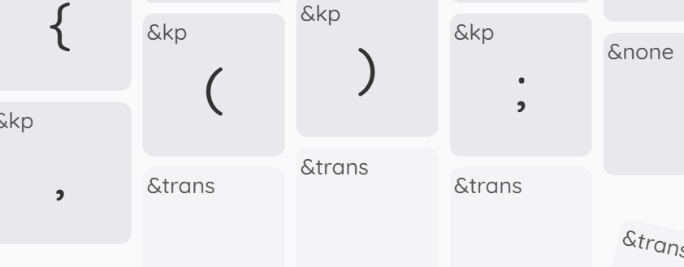

- `~`与`` ` ``相互呼应。
- `_`与其右侧的`-`相互呼应。
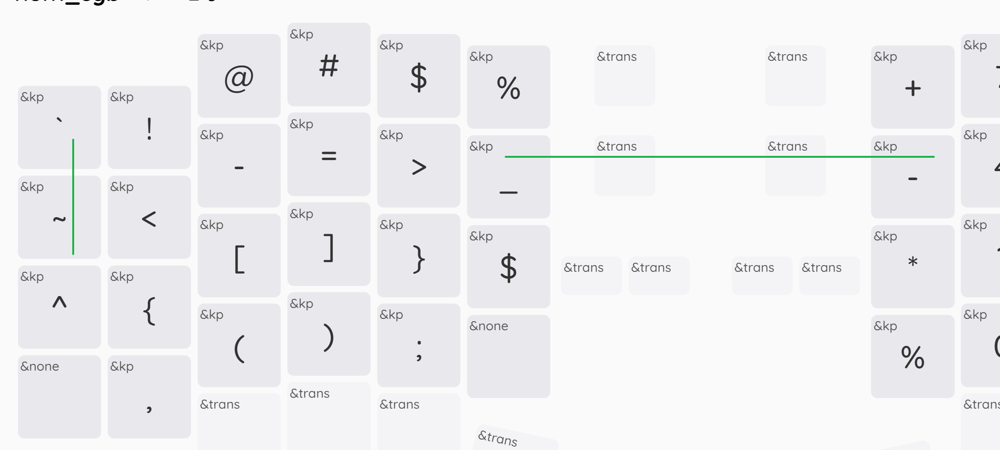

### 方向键高效使用

- home移动到行首，end移动到行尾。小指可以切层时同时按住shift与之组合即可快速选中整行。
- 切到该层不需要拇指键，所以`atl` `shift` `ctrl`与方向间的组合可以被轻松按出而不需要移动手指，这些按键在vscode中非常实用。
- 大写锁定键位置为回车，记忆起来没有难度，先按shift后enter可在聊天窗口中换行。
- 这一层比较难误触其他键，将切换设备相关的键放在这一层
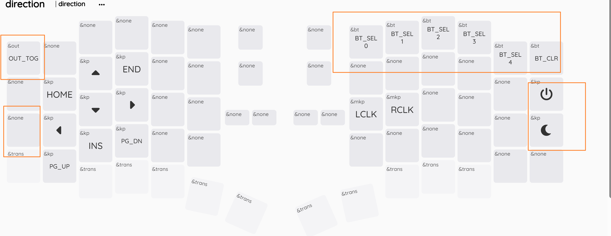
### func键设计

- 由于已经有了高效的数字符号层，所以最上面一排数字键不在需要，在其原本位置放上数字对应的fn1-fn10
- func层保留所有的f1-f24，由于这些键没有被系统占用，可以自由绑定给自己想要的软件而不可能与其他快捷键冲突。
- 其他所有的fn键由基本层的fn键递推而来。可以快速找到。
- 这层也绑定其他特殊功能键如ps等，大写锁定与数字锁定遥相呼应，可以快速找到。

### 鼠标层设计

- 鼠标层设计为透传，可以使用左手默认层的修饰键与快捷键，如ctrl v和ctrl c等。
- 方向键层也有右手鼠标，于是右手单手鼠标也可配合方向键使用。  
- 此外需要组合右手方向键的快捷键也可以和鼠标配合单手使用。

### 拇指键区
- 左右都保留所有修饰键，方便配合方向键层使用。
- 非修饰键的按键都为切层键
  - 长按为切层。
  - 短按为原本功能。
  - 双击并按住为长按目标键。
- 控制键较为特殊，单机为左ctrl键，双击为右ctrl键，配合ctrl键且输入法的软件,可以双击固定切换为中文，单击固定切换为英文。避免中英混合输入时左右脑互博。

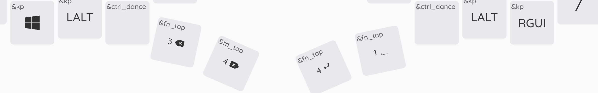

<!-- ## TODO

- backspace enter 以及delete存在多余，是否要必要删除？
- 解决mac键盘上输入法翻页问题。
- 考虑加入hyper键取代现在delete键位置。似乎没有必要，目前的拇指键区设计十分合理。
- 右手拇指区的fu dance可以绑定其他键
- 利用滚轮。
- 是否需要鼠标模拟滚轮？ -->
