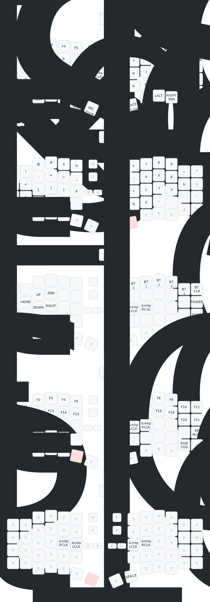

# 个人keymap布局说明


## 拇指键区
- 左右都保留所有修饰键，方便配合方向键层使用。
- 非修饰键的按键都为切层键
  - 长按为切层。
  - 短按为原本功能。
  - 双击并按住为长按目标键。
- 控制键较为特殊，单机为左ctrl键，双击为右ctrl键，配合ctrl键且输入法的软件,可以双击固定切换为中文，单击固定切换为英文。避免中英混合输入时左右脑互博。

### Tap Dance 特殊按键说明

本键盘配置使用了几种特殊的 Tap Dance 功能：

1. **Windows/Control 组合键**
   - **左手 (LF_W/C)**: 单击输出 Windows 键，双击输出右win + 右Control 键。
   - **右手 (RT_W/C)**: 单击输出 Windows 键，双击输出左win +  Control 键。
   - 用来配合win + ctrl + 方向切屏

2. **F键扩展组合**
   - **F1/F11**: 单击 F1，双击 F11
   - **F2/F12**: 单击 F2，双击 F12

3. **Control dance**
   - 单击输出左 Control 键
   - 双击输出右 Control 键
   - **应用**: 配合切输入法软件，双击可固定切换为中文，单击固定切换为英文，避免中英混合输入


## 默认层键盘布局 (ASCII)
```
// -----------------------------------------------------------------------------------------------------------------------------------------------------------
// [ Layer 0 : Default ]
// |  BOOT   | // 该按键在接收器上
//
// |   ESC   | F1/F11  | F2/F12  |   F3    |   F4    |   F5    |  MUTE   |         |   RGB   |   F6    |   F7    |   F8    |   F9    |   F10   |  BKSP   |
// |   TAB   |    Q    |    W    |    E    |    R    |    T    |                             |    Y    |    U    |    I    |    O    |    P    |    \    |
// | FN2/ENT |    A    |    S    |    D    |    F    |    G    |  MCLK   |         |  LCLK   |    H    |    J    |    K    |    L    |    ;    |    '    |
// |  LSHFT  |    Z    |    X    |    C    |    V    |    B    |LCLK|RCLK|         | BL-|BL+ |    N    |    M    |    ,    |    .    |    /    |  RSHFT  |
//                     | LF_W/C  |  LALT   |  CTL_D  | FN3/BKS | FN4/DEL |         | FN4/ENT | FN1/SPC |  CTL_D  |  LALT   | RT_W/C  |
// -----------------------------------------------------------------------------------------------------------------------------------------------------------
```
## 数字符号层配合中文输入法

- 左手拇指键最容易按到的键为空格键。
- 中文输入使用空格键键入当前输入法第一个候选词。
  - 如果第一个候选词不正确，需要数字选词，顺势按下空格，进入数字符号层，可以快速键入数字键。
  - 全平台全输入法共同的翻页键`-`和`=`，此时右手可以顺势翻页。
- 使用上排数字键，而非小键盘的键，以避免num锁定带来的不确定性。

### 数字键符号键层（num-syb）轻松记忆
```
// -----------------------------------------------------------------------------------------------------------------------------------------------------------
// [ Layer 1 : Num & Symbols ]
// |  BOOT   | // 该按键在接收器上
//
// |    `    |    !    |    @    |    #    |    $    |    %    |  trans  |         |  trans  |    +    |    7    |    8    |    9    |    ~    |    ^    |
// |    ~    |    <    |    -    |    =    |    >    |    _    |                             |    -    |    4    |    5    |    6    |    &    |    |    |
// |    ^    |    {    |    [    |    ]    |    }    |    $    |  trans  |         |  trans  |    *    |    1    |    2    |    3    |    :    |    '    |
// |  trans  |    ,    |    (    |    )    |    ;    |  none   |TRNS|TRNS|         |TRNS|TRNS|    %    |    0    |    ,    |    .    |    /    |  trans  |
//                     |  trans  |  trans  |  trans  |  trans  |  trans  |         |  trans  |  trans  |  trans  |  trans  |  trans  |
// -----------------------------------------------------------------------------------------------------------------------------------------------------------
```
- 该层任何字符可以不用组合`shift`来使用。

#### 右手数字区
- 数字键的789和标准键盘上789应该出现的位置一致，而其他数字键之间的相对位置，和标准键盘相对位置相同。
  - 1的位置正好是默认放松状态食指的位置`j`的位置。
- 右上角为位运算符区`~^&|`，c语言的非、异或、和、或，与原本在**标准键盘上**最右侧的`|`字符相互呼应。
- 在数字键左侧是四则运算符号`+—*%`，由于`/`已经在该键标准布局中原本的位置出现过，所以这里用`%`代替。
  - `+`和`-`组合ctrl在大多数应用是放大和缩小。可以右手的大拇指键同时按住ctrl和数字切层键，组合，进行单手的放大缩小。
- 数字区剩下位置是应该出现在标准键盘对应位置的字符，数字区保留这些字符，以方便打出数字与`,./:'`的组合,这在大多数需要输入数字的情况下非常实用。
举例单手数字区可以键入的数字相关内容：
  - 标准日期:`2026-4-26/20:56`
  - C++语言的数字分隔符号`900'000'000`
  - 银行常用的表示千分位逗号`900,000,000`
  - 浮点数`3.1415923`

#### 左手符号区
- 第一排的符号布局和普通标准键盘一致，降低记忆成本。
- 符号区第二横排用于快速键入`<=`,`>=`,`->`,`<-`,`~>`,`<~`等编程需要的符号。
  - `~`符号和其上面的`` ` ``呼应。
  - `_`符号和其右侧左手的`-`呼应。
  - `-`在左而`=`在右边
    - 对应中文输入法翻页
    - 对应应用窗口常用的ctrl+`-=`放大缩小。

- 第三排`^$`分别对应正则表达式的开头和结尾符号。
  - 补充了默认层缺少的中括号大括号和附近的`<>`尖括号以及`（）`呼应
- 第四排最下面一排快速键入编程常见的符号组合：`(,);`

### 方向键高效使用

- home移动到行首，end移动到行尾。小指可以切层时同时按住shift与之组合即可快速选中整行。
- 切到该层不需要拇指键，所以`atl` `shift` `ctrl`与方向间的组合可以被轻松按出而不需要移动手指，这些按键在vscode中非常实用。
- 大写锁定键位置为回车，记忆起来没有难度，先按shift后enter可在聊天窗口中换行。(单手操作)
- 这一层比较难误触其他键，将切换设备相关的键放在这一层

## 方向键层布局
```
// -----------------------------------------------------------------------------------------------------------------------------------------------------------
// [ Layer 2 : Direction & Media ]
// |  BOOT   | // 该按键在接收器上
//
// |   USB   |   BT0   |   BT1   |   BT2   |   BT3   |   BT4   |   PWR   |         |   SLP   |  none   |  none   |  none   |  none   |  none   | BT_CLR  |
// |  none   |  HOME   |    ↑    |   END   |  none   |  none   |                             |  none   |  none   |  none   |  none   |  none   |  none   |
// |  none   |    ←    |    ↓    |    →    |  none   |  none   |  none   |         |  none   |  LCLK   |  RCLK   |  none   |  none   |  none   |  none   |
// |  trans  |  PGUP   |   INS   |  PGDN   |  none   |  none   |NONE|NONE|         |NONE|NONE|  none   |  none   |  none   |  none   |  none   |  none   |
//                     |  trans  |  trans  |  trans  |  trans  |  trans  |         |  trans  |  trans  |  trans  |  trans  |  trans  |
// -----------------------------------------------------------------------------------------------------------------------------------------------------------
```
  
### func键设计

- 由于已经有了高效的数字符号层，所以最上面一排数字键不在需要，在其原本位置放上数字对应的fn1-fn10。这样可以快速定位。
- func层保留所有的f1-f24，由于这些键没有被系统占用，可以自由绑定给自己想要的软件而不可能与其他快捷键冲突。
- 其他所有的fn键由基本层的fn键递推而来。可以快速找到。
- 这层也绑定其他特殊功能键如ps等，大写锁定与数字锁定左右遥相呼应，可以快速找到。
- 由于在bash终端和其他页面频繁切换，剪切复制粘贴很不一致。
  - 这一层切层键对应的`x``c``v`是任意界面通用的复制粘贴和剪切，可以使用其代替普通的复制粘贴。

## 功能键层布局
```
// -----------------------------------------------------------------------------------------------------------------------------------------------------------
// [ Layer 3 : Function ]
// |  BOOT   | // 该按键在接收器上
//
// |   F12   |   F1   |   F2   |   F3   |   F4   |   F5   |  none  |         |  none  |   F6   |   F7   |   F8   |   F9   |  F10   |  F11  |
// |   F12   |  F11   |  F12   |  F13   |  F14   |  F15   |                             |  F16   |  F17   |  F18   |  F19   |  F20   |  F21  |
// |  CAPS   |  F21   |  F22   |  F23   |  F24   |  PRSC   |  none  |         |  none  | LCLK  | RCLK  |  none  |  none  |  none  |NUM_LCK|
// |  trans  |  none  | S(DEL) | C(INS) | S(INS) | S+C+A |NONE|NONE|         |NONE|NONE|  none  |  none  |  none  |  none  |  RGB  |  trans  |
//                     |  trans  |  trans  |  trans  |  trans  |  trans  |         |  trans  |  trans  |  trans  |  trans  |  trans  |
// -----------------------------------------------------------------------------------------------------------------------------------------------------------
```

### 鼠标层设计
- 右手单手进入鼠标层配合小红点可以单手操作鼠标。
  - 不进入鼠标层时，小红点则为滚轮。
- 左手大量单手操作都可以不受右手切层影响，这里不过多进行介绍。
  - 左手的方向层不受影响。
  - 左手的fn层不受影响。

## 鼠标层布局
```
// -----------------------------------------------------------------------------------------------------------------------------------------------------------
// [ Layer 4 : Mouse ]
// |  BOOT   | // 该按键在接收器上
//
// |  trans  |  trans  |  trans  |  trans  |  trans  |  trans  |  trans  |         |  trans  |  trans  |  trans  |  trans  |  trans  |  trans  |  trans  |
// |  trans  |  trans  |  trans  |  trans  |  trans  |  trans  |                             |  trans  |  trans  |  trans  |  trans  |  trans  |  trans  |
// |  trans  |  trans  |  trans  |  trans  |  RCLK   |  LCLK   |  trans  |         |  trans  | LCLK   | RCLK   |  trans  |  trans  |  trans  |  trans  |
// |  trans  |  trans  |  trans  |  trans  |  trans  |  trans  |TRNS|TRNS|         |TRNS|TRNS|  trans  |  trans  |  trans  |  trans  |  trans  |  trans  |
//                     |  trans  |  trans  |  trans  |  trans  |  trans  |         | SPACE  |  trans  |  trans  |  trans  |  trans  |
// -----------------------------------------------------------------------------------------------------------------------------------------------------------```
```

## 完整键盘布局 (Keymap)


<!-- ## TODO

- []backspace enter 以及delete存在多余，是否要必要删除？
- [x] 解决mac键盘上输入法翻页问题。
- []考虑加入hyper键取代现在delete键位置。似乎没有必要，目前的拇指键区设计十分合理。
- []右手拇指区的fu dance可以绑定其他键
- []利用滚轮。
- []是否需要鼠标模拟滚轮？ 
- []完全由用户configure
-->
